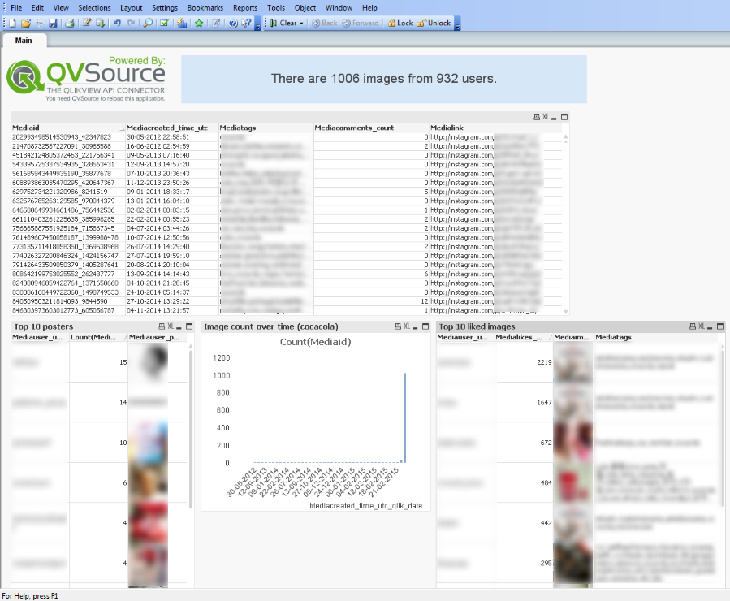

**IMPORTANT** In December 2015, Instagram introduced a new approval process for applications which use their API. Unfortunately our application (for the QVSource Instagram Connector) was rejected which means we can no longer offer this connector.

If you have a version of QVSource which uses the Connector it will likely only function correctly until June 2016, and in any case, we would encourage you to not use the connector any longer.

We are currently leaving this starter app in place in case we are able to successfully re-apply for API access in the future.

------------------

QVSource Instagram Starter App For QlikView
===================================================

This is a starter QlikView application showing how to get started using the [QVSource Instagram Connector](http://wiki.qvsource.com/Instagram-Connector-For-QlikView-And-Qlik-Sense.ashx) for QlikView and Qlik Sense.

*(Note that the load script in this application should also work with Qlik Sense).*

If you are a QlikView + QVSource user you can simply click the ["Download ZIP"](https://github.com/QVSource/QVSource-Instagram-Starter-App-For-QlikView/archive/master.zip) button on GitHub to grab this application.

This application currently supports downloading media tagged with the tag specified in config.txt and saving these into a QVD file. Subsequent reloads should only download newly tagged content.

Please make sure you have first authenticated with the Instagram Connector in QVSource. You should also edit the config.txt file to configure the tag you would like to search for.

The content below is copied from the change log in the first tab of the load script.

Change Log
----------
1.0.1 - 09/03/15
----------------
* Removed user bio and website columns (Instagram have removed these from their API).

1.0.0 - 23/02/15
----------------
* Initial release.
